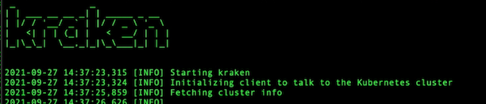

# Krkn aka Kraken
[](https://quay.io/repository/chaos-kubox/krkn?tab=tags&tag=latest)


Chaos and resiliency testing tool for Kubernetes and OpenShift.
Kraken injects deliberate failures into Kubernetes/OpenShift clusters to check if it is resilient to turbulent conditions.


### Workflow


### Demo
[](https://youtu.be/LN-fZywp_mo "Kraken Demo - Click to Watch!")


### Chaos Testing Guide
[Guide](docs/index.md) encapsulates:
- Test methodology that needs to be embraced.
- Best practices that an OpenShift cluster, platform and applications running on top of it should take into account for best user experience, performance, resilience and reliability.
- Tooling.
- Scenarios supported.
- Test environment recommendations as to how and where to run chaos tests.
- Chaos testing in practice.

The guide is hosted at https://redhat-chaos.github.io/krkn.


### How to Get Started
Instructions on how to setup, configure and run Kraken can be found at [Installation](docs/installation.md).

See the [getting started doc](docs/getting_started.md) on support on how to get started with your own custom scenario or editing current scenarios for your specific usage.

After installation, refer back to the below sections for supported scenarios and how to tweak the kraken config to load them on your cluster.


#### Running Kraken with minimal configuration tweaks
For cases where you want to run Kraken with minimal configuration changes, refer to [Kraken-hub](https://github.com/redhat-chaos/krkn-hub). One use case is CI integration where you do not want to carry around different configuration files for the scenarios.

### Setting up infrastructure dependencies
Kraken indexes the metrics specified in the profile into Elasticsearch in addition to leveraging Cerberus for understanding the health of the Kubernetes/OpenShift cluster under test. More information on the features is documented below. The infrastructure pieces can be easily installed and uninstalled by running:

```
$ cd kraken
$ podman-compose up or $ docker-compose up      # Spins up the containers specified in the docker-compose.yml file present in the run directory.
$ podman-compose down or $ docker-compose down  # Delete the containers installed.
```
This will manage the Cerberus and Elasticsearch containers on the host on which you are running Kraken.

**NOTE**: Make sure you have enough resources (memory and disk) on the machine on top of which the containers are running as Elasticsearch is resource intensive. Cerberus monitors the system components by default, the [config](config/cerberus.yaml) can be tweaked to add applications namespaces, routes and other components to monitor as well. The command will keep running until killed since detached mode is not supported as of now.


### Config
Instructions on how to setup the config and the options supported can be found at [Config](docs/config.md).


### Kubernetes/OpenShift chaos scenarios supported

Scenario type               | Kubernetes    | OpenShift
--------------------------- | ------------- | -------------------- |  
[Pod Scenarios](docs/pod_scenarios.md) | :heavy_check_mark: | :heavy_check_mark: |
[Container Scenarios](docs/container_scenarios.md) | :heavy_check_mark: | :heavy_check_mark: |
[Node Scenarios](docs/node_scenarios.md) | :heavy_check_mark: | :heavy_check_mark: |
[Time Scenarios](docs/time_scenarios.md) | :x: | :heavy_check_mark: |
[Litmus Scenarios](docs/litmus_scenarios.md) | :x: | :heavy_check_mark: |
[Cluster Shut Down Scenarios](docs/cluster_shut_down_scenarios.md) | :heavy_check_mark: | :heavy_check_mark: |
[Namespace Scenarios](docs/namespace_scenarios.md) | :heavy_check_mark: | :heavy_check_mark: |
[Zone Outage Scenarios](docs/zone_outage.md) | :heavy_check_mark: | :heavy_check_mark: |
[Application_outages](docs/application_outages.md) | :heavy_check_mark: | :heavy_check_mark: |
[PVC scenario](docs/pvc_scenario.md) | :heavy_check_mark: | :heavy_check_mark: |
[Network_Chaos](docs/network_chaos.md) | :heavy_check_mark: | :heavy_check_mark: |


### Kraken scenario pass/fail criteria and report
It is important to make sure to check if the targeted component recovered from the chaos injection and also if the Kubernetes/OpenShift cluster is healthy as failures in one component can have an adverse impact on other components. Kraken does this by:
- Having built in checks for pod and node based scenarios to ensure the expected number of replicas and nodes are up. It also supports running custom scripts with the checks.
- Leveraging [Cerberus](https://github.com/openshift-scale/cerberus) to monitor the cluster under test and consuming the aggregated go/no-go signal to determine pass/fail post chaos. It is highly recommended to turn on the Cerberus health check feature available in Kraken. Instructions on installing and setting up Cerberus can be found [here](https://github.com/openshift-scale/cerberus#installation) or can be installed from Kraken using the [instructions](https://github.com/redhat-chaos/krkn#setting-up-infrastructure-dependencies). Once Cerberus is up and running, set cerberus_enabled to True and cerberus_url to the url where Cerberus publishes go/no-go signal in the Kraken config file. Cerberus can monitor [application routes](https://github.com/redhat-chaos/cerberus/blob/main/docs/config.md#watch-routes) during the chaos and fails the run if it encounters downtime as it is a potential downtime in a customers, or users environment as well. It is especially important during the control plane chaos scenarios including the API server, Etcd, Ingress etc. It can be enabled by setting `check_applicaton_routes: True` in the [Kraken config](https://github.com/redhat-chaos/krkn/blob/main/config/config.yaml) provided application routes are being monitored in the [cerberus config](https://github.com/redhat-chaos/krkn/blob/main/config/cerberus.yaml).
- Leveraging [kube-burner](docs/alerts.md) alerting feature to fail the runs in case of critical alerts.

### Signaling
In CI runs or any external job it is useful to stop Kraken once a certain test or state gets reached. We created a way to signal to kraken to pause the chaos or stop it completely using a signal posted to a port of your choice.

For example if we have a test run loading the cluster running and kraken separately running; we want to be able to know when to start/stop the kraken run based on when the test run completes or gets to a certain loaded state.

More detailed information on enabling and leveraging this feature can be found [here](docs/signal.md).


### Performance monitoring
Monitoring the Kubernetes/OpenShift cluster to observe the impact of Kraken chaos scenarios on various components is key to find out the bottlenecks as it is important to make sure the cluster is healthy in terms if both recovery as well as performance during/after the failure has been injected. Instructions on enabling it can be found [here](docs/performance_dashboards.md).


### Scraping and storing metrics long term
Kraken supports capturing metrics for the duration of the scenarios defined in the config and indexes then into Elasticsearch to be able to store and evaluate the state of the runs long term. The indexed metrics can be visualized with the help of Grafana. It uses [Kube-burner](https://github.com/cloud-bulldozer/kube-burner) under the hood. The metrics to capture need to be defined in a metrics profile which Kraken consumes to query prometheus ( installed by default in OpenShift ) with the start and end timestamp of the run. Information on enabling and leveraging this feature can be found [here](docs/metrics.md).


### Alerts
In addition to checking the recovery and health of the cluster and components under test, Kraken takes in a profile with the Prometheus expressions to validate and alerts, exits with a non-zero return code depending on the severity set. This feature can be used to determine pass/fail or alert on abnormalities observed in the cluster based on the metrics. Information on enabling and leveraging this feature can be found [here](docs/alerts.md).


### Blogs and other useful resources
- Blog post on introduction to Kraken: https://www.openshift.com/blog/introduction-to-kraken-a-chaos-tool-for-openshift/kubernetes
- Discussion and demo on how Kraken can be leveraged to ensure OpenShift is reliable, performant and scalable: https://www.youtube.com/watch?v=s1PvupI5sD0&ab_channel=OpenShift
- Blog post emphasizing the importance of making Chaos part of Performance and Scale runs to mimic the production environments: https://www.openshift.com/blog/making-chaos-part-of-kubernetes/openshift-performance-and-scalability-tests


### Roadmap
Following is a list of enhancements that we are planning to work on adding support in Kraken. Of course any help/contributions are greatly appreciated.
- [Ability to visualize the metrics that are being captured by Kraken and stored in Elasticsearch](https://github.com/redhat-chaos/krkn/issues/124)
- Continue to improve [Chaos Testing Guide](https://cloud-bulldozer.github.io/kraken/) in terms of adding best practices, test environment recommendations and scenarios to make sure the OpenShift platform, as well the applications running on top it, are resilient and performant under chaotic conditions.
- Support for running Kraken on Kubernetes distribution - see https://github.com/redhat-chaos/krkn/issues/185, https://github.com/redhat-chaos/krkn/issues/186
- Sweet logo for Kraken - see https://github.com/redhat-chaos/krkn/issues/195


### Contributions
We are always looking for more enhancements, fixes to make it better, any contributions are most welcome. Feel free to report or work on the issues filed on github.

[More information on how to Contribute](docs/contribute.md)

If adding a new scenario or tweaking the main config, be sure to add in updates into the CI to be sure the CI is up to date.
Please read [this file]((CI/README.md#adding-a-test-case)) for more information on updates.


### Community
Key Members(slack_usernames/full name): paigerube14/Paige Rubendall, mffiedler/Mike Fiedler, ravielluri/Naga Ravi Chaitanya Elluri.
* [**#sig-scalability on Kubernetes Slack**](https://kubernetes.slack.com)
* [**#forum-chaos on CoreOS Slack internal to Red Hat**](https://coreos.slack.com)
