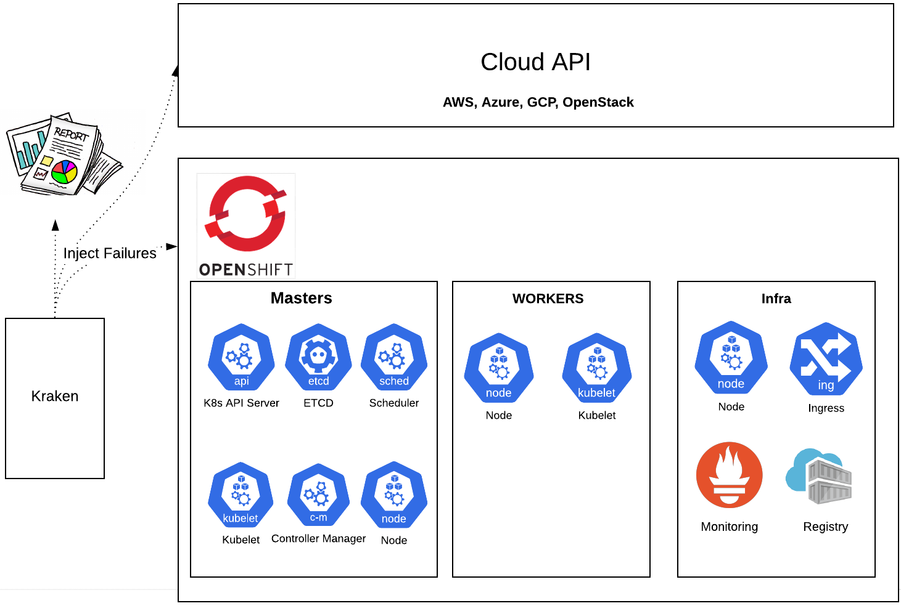
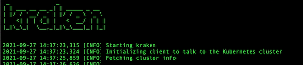

# Krkn aka Kraken


[](https://www.bestpractices.dev/projects/10548)
[](https://clomonitor.io/projects/cncf/krkn)


Chaos and resiliency testing tool for Kubernetes.
Kraken injects deliberate failures into Kubernetes clusters to check if it is resilient to turbulent conditions.

## 🚀 New: Chaos Template Library

KRKN now includes a comprehensive **Chaos Template Library** with pre-configured scenarios for quick execution:

- **Pod Failure**: Test application restart policies
- **Node Failure**: Validate cluster self-healing  
- **Network Latency**: Test performance under poor network
- **CPU/Disk Stress**: Identify resource bottlenecks
- **VM Outage**: OpenShift Virtualization testing
- And more!

### Quick Start with Templates

```bash
# List available templates
python krkn/template_manager.py list

# Run a pod failure test
python krkn/template_manager.py run pod-failure

# Customize with parameters
python krkn/template_manager.py run network-latency --param latency="200ms"
```

📖 **[Full Template Documentation](docs/chaos-templates.md)**


### Workflow
 


<!-- ### Demo
[](https://youtu.be/LN-fZywp_mo "Kraken Demo - Click to Watch!") -->


### How to Get Started
Instructions on how to setup, configure and run Kraken can be found in the [documentation](https://krkn-chaos.dev/docs/).


### Blogs, podcasts and interviews
Additional resources, including blog posts, podcasts, and community interviews, can be found on the [website](https://krkn-chaos.dev/blog)


### Roadmap
Enhancements being planned can be found in the [roadmap](ROADMAP.md).


### Contributions
We are always looking for more enhancements, fixes to make it better, any contributions are most welcome. Feel free to report or work on the issues filed on github.

[More information on how to Contribute](https://krkn-chaos.dev/docs/contribution-guidelines/)


### Community
Key Members(slack_usernames/full name): paigerube14/Paige Rubendall, mffiedler/Mike Fiedler, tsebasti/Tullio Sebastiani, yogi/Yogananth Subramanian, sahil/Sahil Shah, pradeep/Pradeep Surisetty and ravielluri/Naga Ravi Chaitanya Elluri.
* [**#krkn on Kubernetes Slack**](https://kubernetes.slack.com/messages/C05SFMHRWK1)

The Linux Foundation® (TLF) has registered trademarks and uses trademarks. For a list of TLF trademarks, see [Trademark Usage](https://www.linuxfoundation.org/legal/trademark-usage).
