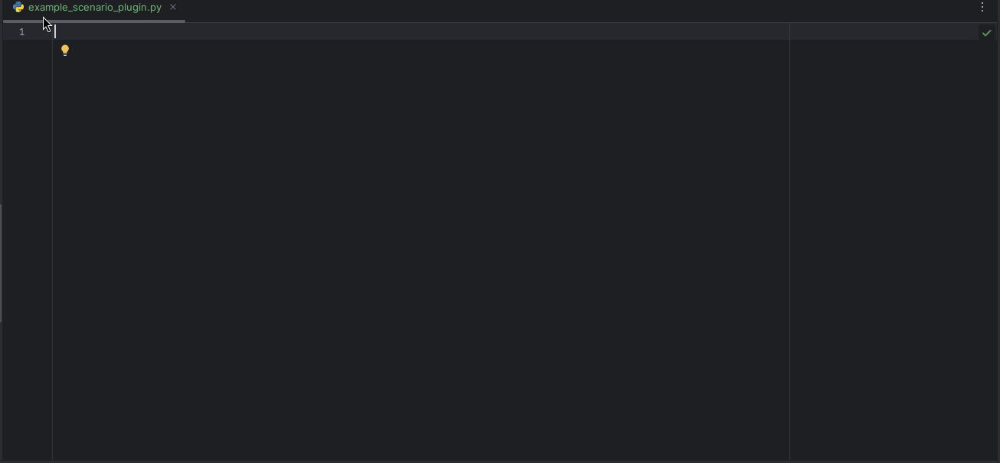

# Scenario Plugin API:

This API enables seamless integration of Scenario Plugins for Krkn. Plugins are automatically 
detected and loaded by the plugin loader, provided they extend the `AbstractPluginScenario` 
abstract class, implement the required methods, and adhere to the specified [naming conventions](#naming-conventions).

## Plugin folder:

The plugin loader automatically loads plugins found in the `krkn/scenario_plugins` directory, 
relative to the Krkn root folder. Each plugin must reside in its own directory and can consist 
of one or more Python files. The entry point for each plugin is a Python class that extends the 
[AbstractPluginScenario](../krkn/scenario_plugins/abstract_scenario_plugin.py) abstract class and implements its required methods.

## `AbstractPluginScenario` abstract class:

This [abstract class](../krkn/scenario_plugins/abstract_scenario_plugin.py) defines the contract between the plugin and krkn.
It consists of two methods:
- `run(...)`
- `get_scenario_type()`

Most IDEs can automatically suggest and implement the abstract methods defined in `AbstractPluginScenario`:

_(IntelliJ PyCharm)_

### `run(...)`

```python
    def run(
        self,
        run_uuid: str,
        scenario: str,
        krkn_config: dict[str, any],
        lib_telemetry: KrknTelemetryOpenshift,
        scenario_telemetry: ScenarioTelemetry,
    ) -> int:

```

This method represents the entry point of the plugin and the first method 
that will be executed.
#### Parameters:

- `run_uuid`:
  - the uuid of the chaos run generated by krkn for every single run.
- `scenario`:
  - the config file of the scenario that is currently executed
- `krkn_config`:
  - the full dictionary representation of the `config.yaml`
- `lib_telemetry`
  - it is a composite object of all the [krkn-lib](https://krkn-chaos.github.io/krkn-lib-docs/modules.html) objects and methods needed by a krkn plugin to run.
- `scenario_telemetry`
  - the `ScenarioTelemetry` object of the scenario that is currently executed
 
### Return value:
Returns 0 if the scenario succeeds and 1 if it fails.
> [!WARNING]
> All the exception must be handled __inside__ the run method and not propagated.

## Naming conventions:
A key requirement for developing a plugin that will be properly loaded 
by the plugin loader is following the established naming conventions. 
These conventions are enforced to maintain a uniform and readable codebase, 
making it easier to onboard new developers from the community.

### plugin folder:
- the plugin folder must be placed in the `krkn/scenario_plugin` folder starting from the krkn root folder
- the plugin folder __cannot__ contain the words
  - `plugin`
  - `scenario`
### plugin file name and class name:
- the plugin file containing the main plugin class must be named in _snake case_ and must have the suffix `_scenario_plugin`: 
  - `example_scenario_plugin.py`
- the main plugin class must named in _capital camel case_ and must have the suffix `ScenarioPlugin` : 
  - `ExampleScenarioPlugin`
- the file name must match the class name in the respective syntax:
  - `example_scenario_plugin.py` -> `ExampleScenarioPlugin`

### scenario type:
- the scenario type __must__ be unique between all the scenarios.

### logging:
If your new scenario does not adhere to the naming conventions, an error log will be generated in the Krkn standard output,
providing details about the issue:

```commandline
2024-09-18 14:48:41,734 [INFO] Loaded Scenario Plugins:

2024-09-18 14:48:41,735 [INFO]   ✅ Class: ApplicationOutageScenarioPlugin ScenarioType: application_outages
2024-09-18 14:48:41,735 [INFO]   ✅ Class: ArcaflowScenarioPlugin ScenarioType: arcaflow_scenarios
2024-09-18 14:48:41,735 [INFO]   ✅ Class: ManagedClusterScenarioPlugin ScenarioType: managedcluster_scenarios
2024-09-18 14:48:41,735 [INFO]   ✅ Class: NativeScenarioPlugin ScenarioType: plugin_scenarios
2024-09-18 14:48:41,735 [INFO]   ✅ Class: NetworkChaosScenarioPlugin ScenarioType: network_chaos
2024-09-18 14:48:41,735 [INFO]   ✅ Class: NodeActionsScenarioPlugin ScenarioType: node_scenarios
2024-09-18 14:48:41,735 [INFO]   ✅ Class: PvcScenarioPlugin ScenarioType: pvc_scenarios
2024-09-18 14:48:41,735 [INFO]   ✅ Class: ServiceDisruptionScenarioPlugin ScenarioType: service_disruption_scenarios
2024-09-18 14:48:41,735 [INFO]   ✅ Class: ServiceHijackingScenarioPlugin ScenarioType: service_hijacking
2024-09-18 14:48:41,735 [INFO]   ✅ Class: ShutDownScenarioPlugin ScenarioType: cluster_shut_down_scenarios
2024-09-18 14:48:41,735 [INFO]   ✅ Class: SynFloodScenarioPlugin ScenarioType: syn_flood
2024-09-18 14:48:41,735 [INFO]   ✅ Class: TimeActionsScenarioPlugin ScenarioType: time_scenarios
2024-09-18 14:48:41,735 [INFO]   ✅ Class: ZoneOutageScenarioPlugin ScenarioType: zone_outages
2024-09-18 14:48:41,735 [INFO] 

2024-09-18 14:48:41,735 [INFO] Failed to load Scenario Plugins:

2024-09-18 14:48:41,735 [ERROR] ⛔ Class: ExamplePluginScenario Module: krkn.scenario_plugins.example.example_scenario_plugin
2024-09-18 14:48:41,735 [ERROR] ⚠️ scenario plugin class name must start with a capital letter, end with `ScenarioPlugin`, and cannot be just `ScenarioPlugin`.
```

## ExampleScenarioPlugin
The [ExampleScenarioPlugin](../krkn/tests/test_plugins/example_scenario_plugin.py) class included in the tests folder can be used as a scaffolding for new plugins and it is considered
part of the documentation.

For any questions or further guidance, feel free to reach out to us on the 
[Kubernetes workspace](https://kubernetes.slack.com/) in the `#krkn` channel. 
We’re happy to assist. Now, __release the Krkn!__

