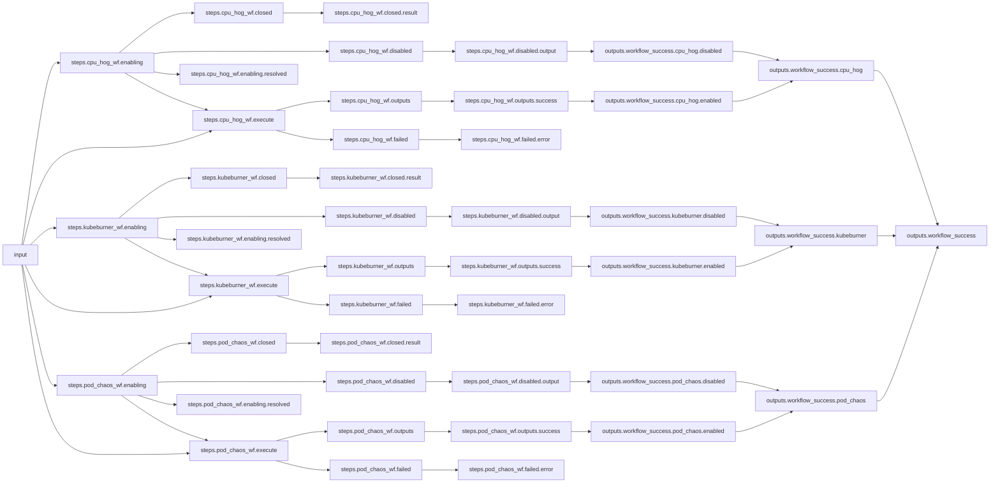
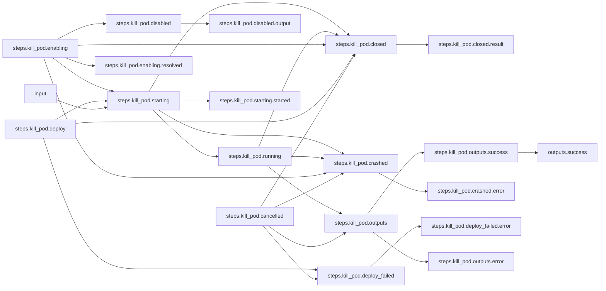
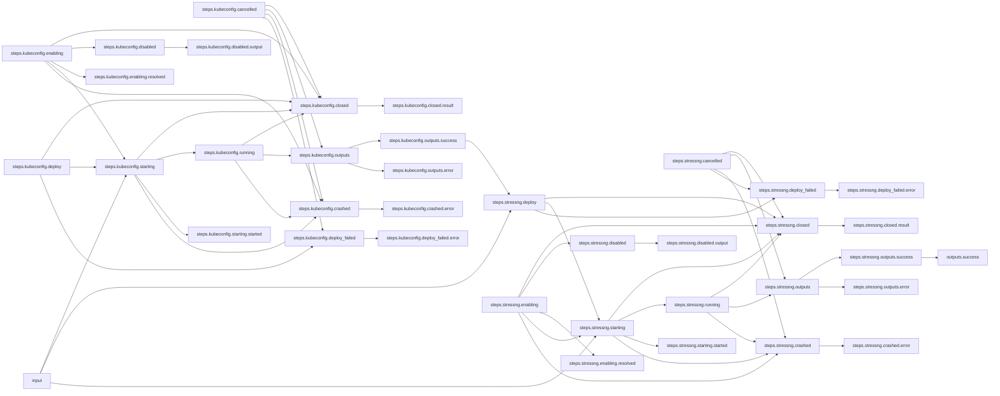
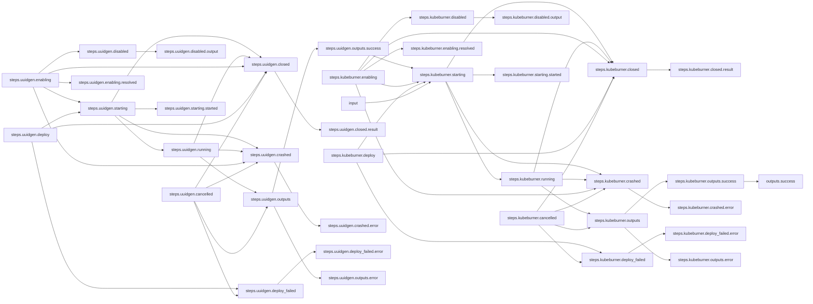

# OpenShift Shenanigans

## Workflow Description

Given a target OpenShift cluster, this workflow executes a 
[kube-burner plugin](https://github.com/redhat-performance/arcaflow-plugin-kube-burner) 
workflow to place a load on the cluster, repeatedly removes a targeted pod at a given time frequency with the [kill-pod plugin](https://github.com/krkn-chaos/arcaflow-plugin-kill-pod),
and runs a [stress-ng](https://github.com/ColinIanKing/stress-ng) CPU workload on the cluster. 
Target your OpenShift cluster with the appropriate `kubeconfig` file, and add its file path as 
the value for `kubernetes_target.kubeconfig_path`, in the input file. Any combination of subworkflows can be disabled in the input file by setting either `cpu_hog_enabled`, `pod_chaos_enabled`, or `kubeburner_enabled` to `false`. 


## Files

- [`workflow.yaml`](workflow.yaml) -- Defines the workflow input schema, the plugins to run
  and their data relationships, and the output to present to the user
- [`input.yaml`](input.yaml) -- The input parameters that the user provides for running
  the workflow
- [`config.yaml`](config.yaml) -- Global config parameters that are passed to the Arcaflow
  engine
- [`cpu-hog.yaml`](subworkflows/cpu-hog.yaml) -- The StressNG workload on the CPU.
- [`kubeburner.yaml`](subworkflows/kubeburner.yaml) -- The KubeBurner workload for the Kubernetes Cluster API.
- [`pod-chaos.yaml`](subworkflows/pod-chaos.yaml) -- The Kill Pod workflow for the Kubernetes infrastructure pods.
                     
## Running the Workflow

### Workflow Dependencies

Install Python, at least `3.9`.

First, add the path to your Python interpreter to `config.yaml` as the value 
for `pythonPath` as shown here. A common choice for users working in 
distributions of Linux operating systems is `usr/bin/python`. Second, add a 
directory to which your Arcaflow process will have write access as the 
value for `workdir`, `/tmp` is a common choice because your process will likely be able to write to it.

```yaml
deployers:
  python:
    pythonPath: /usr/bin/python
    workdir: /tmp
```

To use this Python interpreter with our `kill-pod` plugin, go to the `deploy` section of the `kill_pod` step in [`pod-chaos.yaml`](subworkflows/pod-chaos.yaml). You can use the same `pythonPath` and `workdir` that you used in 
your `config.yaml`.

```yaml
deploy:
  deployer_name: python
  modulePullPolicy: Always
  pythonPath: /usr/bin/python
  workdir: /tmp
```

Download a Go binary of the latest version of the Arcaflow engine from: https://github.com/arcalot/arcaflow-engine/releases.

#### OpenShift Target

Target your desired OpenShift cluster by setting the `kubeconfig_path` variable for each subworkflow's parameter list in [`input.yaml`](input.yaml).

#### Kube-Burner Plugin

The `kube-burner` plugin generates and reports the UUID to which the 
`kube-burner` data is associated in your search database. The `uuidgen` 
workflow step uses the `arcaflow-plugin-utilities` `uuid` plugin step to 
randomly generate a UUID for you.

### Workflow Execution

Run the workflow:
```
$ export WFPATH=<path to this workflow directory>
$ arcaflow --context ${WFPATH} --input input.yaml --config config.yaml --workflow workflow.yaml
```

## Workflow Diagram
This diagram shows the complete end-to-end workflow logic.

### Main Workflow



### Pod Chaos Workflow



### StressNG (CPU Hog) Workflow



### Kube-Burner Workflow



